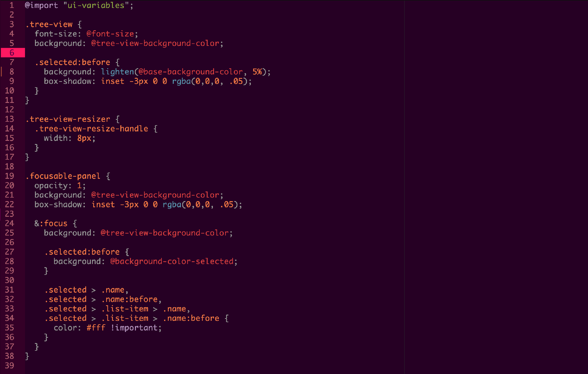

# Haunter Syntax Theme

Atom syntax theme using dark purples and pinks primarily, inspired by
the titular Pokémon.

There's also a matching [haunter ui theme](https://github.com/haunterio/haunter-atom-ui).
